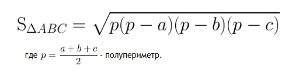

#### 4.17. Домашняя работа 4.3

**Цель задания**

Научиться применять арифметические операции и методы класса java.lang.Math.

**Что нужно сделать**

Прочитать [документацию к классу Math](https://docs.oracle.com/javase/8/docs/api/java/lang/Math.html) на официальном сайте Oracle и реализовать методы работы с геометрическими фигурами, используя методы класса Math и арифметические операции.

В проекте GeometryCalculator реализуйте в классе GeometryCalculator методы:

— подсчёта площади круга, площади треугольника и объёма сферы;  
— проверки возможности построения треугольника по трём длинам сторон.

**Рекомендации для реализации формул**

- площадь треугольника по трём сторонам:

- Условие возможности построения треугольника: у треугольника сумма любых двух сторон должна быть больше третьей.

**Критерии оценки**

«Зачёт» — методы считают верные значения.  
«Незачёт» — задание не выполнено.
